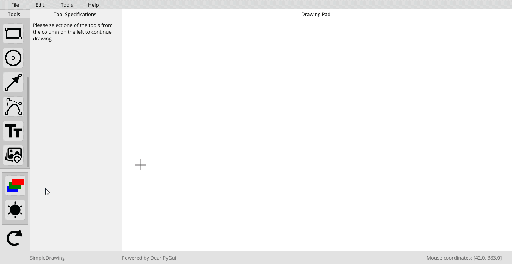

# SimpleDrawing

__*Note: Since the release of this app, Dear PyGui has been updated considerably. This app will not run in the newer versions of Dear PyGui. Please note that this app is not being maintained currently.*__

A very basic desktop app built using DearPyGui framework for sketching purposes.

<h3>Features include:</h3>

1. Draw straight lines
2. Draw straight dashed lines
3. Draw poly lines
4. Doodle
5. Draw rectangles
6. Draw circles
7. Draw arrows
8. Draw 4-point Bézier curves
9. Add text on canvas
10. Add image on canvas
11. Constraint lines to horizontal, vertical, or 45&deg; by holding down the shift key
12. Constraint rectangles to squares by holding down the shift key
13. Constraint images to their correct aspect ratio by holding down the shift key
14. Change canvas color
15. Switch between dark and light mode
16. Erase all drawn lines
17. Save drawing as a JPEG, PNG, or PDF file
18. Save drawing as a database file that can be opened and edited
19. Undo and redo all tools used
20. Reset the entire drawing pad

<H3>Instructions</H3>

1. Make sure you have Python 3 installed and working. 
   
2. Clone the repo:

```git clone https://github.com/RahulShagri/SimpleDrawing-Desktop-App.git```

3. Install prerequisites using pip, preferably in a new environment:

```pip install -r requirements.txt``` 

4. Run the <i>SimpleDrawing.py</i> file to start the application.

<h3>Demo</h3>



<H2>Contact</H2>

You can contact me using the messaging form or the emailing option on my [engineering portfolio website](https://rahulshagri.github.io/).
